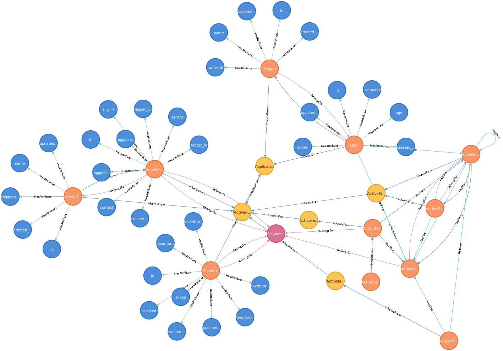

# RailsGraph

[](https://badge.fury.io/rb/rails_graph)

Graph visualization for Rails applications using [Neo4j Browser](https://neo4j.com/docs/browser-manual/current/). 

Gain visibility on your Rails application data model and identify bottlenecks. It is an ERD, but interactive and queryable using [Cypher](https://neo4j.com/developer/cypher/).



https://github.com/ahmad-elassuty/rails_graph/assets/4674035/53deb04e-f995-4af6-9496-a873f84b5445

## Features

- Application Databases and Tables
- ActiveRecord Models
    - Metadata, e.g size, indexes
    - Columns (disabled by default)
        - Metadata, e.g type and constraints
    - Associations
        - HasMany
        - BelongsTo
        - HasOne
        - HasAndBelongsToMany
        - Support for Polymorphic Associations
- ActiveRecord Abstract models
- Class Hierarchy
- [Packwerk](https://github.com/Shopify/packwerk) packages (disabled by default)
- Application Gems (disabled by default)

## Installation

Install the gem and add to the application's Gemfile by executing:

    $ bundle add rails_graph

## Usage

After installing RailsGraph to your Rails application, run the following rake task to scan your app and export it to Neo4j:

```
rails rails_graph:export:neo4j -- -u neo4j -p admin -h neo4j://localhost:7687
```

Then explore your model on Neo4j Browser.

### Neo4j

To learn how to use Neo4j Browser, check out the [documentation](https://neo4j.com/docs/browser-manual/current/visual-tour/).

#### Self setup
If you have Neo4j running locally, e.g using Docker, then the browser is most likely accessible through: http://localhost:7474/browser/

#### Cloud Options
If you prefer to have a cloud managed server, feel free to check out [Neo4j AuraDB](https://neo4j.com/cloud/platform/aura-graph-database/), it provides a free instance.

## Config

You can control what RailsGraph will include in the final graph by:

```ruby
# config/initializers/rails_graph.rb

RailsGraph.configure do |config|
  # Explicitly define classes that are not loaded automatically
  config.include_classes = [ActsAsTaggableOn::Tag, ActsAsTaggableOn::Tagging]

  # Enable Columns visualisation
  # default false
  config.columns = true

  # Enable Class Hierarchy visualisation
  # default true
  config.inheritance = true

  # Enable Databases visualisation
  # default true
  config.databases = false

  # Enable Packwerk packages visualisation
  # default false
  config.include_packwerk = true

  # Enable Gems visualisation
  # default false
  config.gems = true
end
```

### Sample Project

Checkout RailsGraph Example repo [here](https://github.com/ahmad-elassuty/rails_graph_example)

## Development

After checking out the repo, run `bin/setup` to install dependencies. Then, run `rake spec` to run the tests. You can also run `bin/console` for an interactive prompt that will allow you to experiment.

To install this gem onto your local machine, run `bundle exec rake install`. To release a new version, update the version number in `version.rb`, and then run `bundle exec rake release`, which will create a git tag for the version, push git commits and the created tag, and push the `.gem` file to [rubygems.org](https://rubygems.org).

## Contributing

Bug reports and pull requests are welcome on GitHub at https://github.com/ahmad-elassuty/rails_graph. This project is intended to be a safe, welcoming space for collaboration, and contributors are expected to adhere to the [code of conduct](https://github.com/ahmad-elassuty/rails_graph/blob/master/CODE_OF_CONDUCT.md).

## License

The gem is available as open source under the terms of the [MIT License](https://opensource.org/licenses/MIT).

## Code of Conduct

Everyone interacting in the RailsGraph project's codebases, issue trackers, chat rooms and mailing lists is expected to follow the [code of conduct](https://github.com/ahmad-elassuty/rails_graph/blob/master/CODE_OF_CONDUCT.md).
